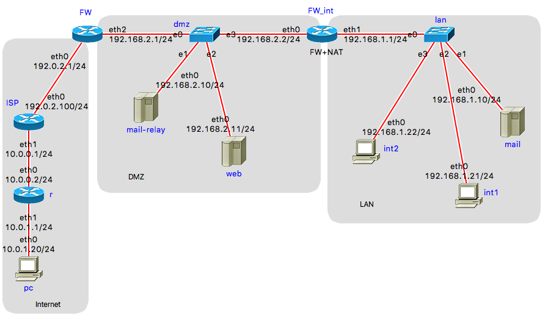

# Lab 3
# Network protocols security and firewall

Fetch the latest version of assignment from the repository:

```
$ git pull
```

Three network interfaces are available on your virtual machine:

- NAT
- Bridged Adapter
- Host-only Adapter

Login into the virtual machine and check the assigned IP addresses:
```
$ ip addr
...
2: enp0s3: <BROADCAST,MULTICAST,UP,LOWER_UP> mtu 1500 qdisc fq_codel state UP group default qlen 1000
    inet 10.0.2.15/24 brd 10.0.2.255 scope global dynamic noprefixroute enp0s3
...
3: enp0s8: <BROADCAST,MULTICAST,UP,LOWER_UP> mtu 1500 qdisc fq_codel state UP group default qlen 1000
    inet 10.19.0.136/24 brd 10.19.0.255 scope global dynamic noprefixroute enp0s8
...
4: enp0s9: <BROADCAST,MULTICAST,UP,LOWER_UP> mtu 1500 qdisc fq_codel state UP group default qlen 1000
    inet 192.168.56.101/24 brd 192.168.56.255 scope global dynamic noprefixroute enp0s9
```

In this example, interfaces have the following IP addresses:

- NAT interface: 10.19.0.136, 
- Bridged interface: 10.0.2.15, 
- Host-only interface: 192.168.56.101.

The assignment consists of 4 parts.
The first two are executed on your local machine, not the virtual machine.

The "external IP addresses" of your virtual machine are the IP addresses
assigned to "Bridged" and "Host-only" interfaces.


## 1) Ping scanning

NOTE: This part is executed on your local machine, not the virtual machine.
With the `ping` command ping the following machines:

    1. your virtual machine
    2. mail.fer.hr
    3. 161.53.19.1
    4. imunes.net

Study the returned TTL values. Deduct the starting TTL values. Can you conclude
which operating system is currently running on those virtual machines? Explain.

## 2) Nmap scanning

NOTE: This part is executed on your local machine, not the virtual machine.
Before starting the scan, inside the virtual machine start the following command
which will enable you to monitor incoming connections to the virtual machine:

```
    $ watch -n 0.5 netstat -ant
```

With the `nmap` tool discover currently running services on the virtual machine.
Test the following `nmap` possibilities:

- scanning of TCP and UDP ports
- TCP syn scan
- operating system detection (-O)
- detect running services versions (-sV)
- general scan (-A flag)

Which scanning method could be detected on the virtual machine. Explain.

Using Wireshark on you host machine you can see network traffic generated by `nmap`.

Run `nmap` inside the virtual machine (scanning `localhost` or 127.0.0.1) and compare the results:
```
    C:\> nmap -sV _external_IP_address_

    sui@sui$ sudo nmap -sV localhost
```
How do they differ? Explain.
 
## 3) Firewall configuration

The third part of the assignment is executed inside the virtual machine using 
IMUNES network simulator.

`NETWORK.imn` is IMUNES configuration file representing the network with demilitarized zone.

Start IMUNES:

```
$ sudo imunes NETWORK.imn
```

Start the experiment (IMUNES menu "Experiment", select "Execute").
That will create virtual nodes and links and also start some network services:

- SSH server on nodes FW, FW_int, mail-relay, web and mail,
- HTTP server on node web,
- e-mail server (SMTP) on nodes mail-relay and mail.

 

Your task is to configure the firewall on nodes FW and FW_int.

Check your configuration running nmap scan from various nodes, outside the
local network (node pc in the "Internet" part of the simulated network) and
from the local network (nodes int1 and int2 on the "LAN" part).

External firewall (FW) has two interfaces:
- eth0, connecting the network with Internet Service Provider (ISP), with static IP 192.0.2.1/24,
- eht1, internal network interface toward demilitarized zone, with static address 192.168.2.1/24.

Inside DMZ there are two servers, web server (web) and 
e-mail server (mail-relay).

Internal firewall (FW_int) is situated between DMZ and internal network (LAN):
- eth0, static IP address 192.168.2.2/24,
- eth1, static IP address 192.168.1.1/24.

Inside the local network (LAN), there are e-mail server (mail) and two PCs, int1 and int2.

Network address translation (NAT) is already configured on node FW_int (script `FW_int.sh`i):
- all connections from LAN toward Internet are translated to IP address 
of the interface eth0 on FW_int, 192.168.2.2,
- IP address is not changed for the connections toward hosts in DMZ.

NAT rules are already written in file `FW_int.sh`. You don't have to change them.

Your task is to add `iptables` rules on FW and FW_int that would enable:

- hosts from LAN have unlimited access to hosts in DMZ and Internet,
- access from external network (Internet) to LAN is denied,
- access from DMZ to LAN is denied except for the mail-relay server that
delivers e-mail to internal server `mail` (SMTP protocol, port 25), 
- from the outside network (Internet) access is allowed only to `web` server
using protocols HTTP and HTTPS (ports 80 and 443), and e-mail server
`mail-relay` using SMTP (port 25),
- access to Internet from hosts `web` and `mail-relay` is allowed only for
protocol DNS using UDP i TCP protocol on port 53,
- access to firewall hosts FW and FW_int is allowed only from `int1` using
SSH (port 22),
- add appropriate "anti-spoofing" rules.

### Shell scripts for firewall configuration

There are two shell scripts that can be used for firewall configuration (iptables): `FW.sh` i `FW_int.sh`.

You should add your iptables rules inside the `script_body` procedure.

Copy the scripts to the appropriate nodes and start them:

```
    $ sudo su
    # hcp FW.sh FW:
    # himage FW ./FW.sh start

    # hcp FW_int.sh FW_int:
    # himage FW_int ./FW_int.sh start
``` 

If you want to disable traffic filtering, script can be started with the "stop" argument. That will remove all iptables rules and change the policy to "accept all":

``` 
    # himage FW_int ./FW_int.sh stop
``` 

### Testing

Check the availability of the services in DMZ for nodes in Internet (node pc):
```
    himage pc nmap -n -Pn "-p20-25,53,80,443" 192.168.2.10
    himage pc nmap -n -Pn "-p20-25,53,80,443" 192.168.2.11
```

Check the availability of the services in DMZ for nodes in LAN (node int1):

```
    himage int1 nmap -n -Pn "-p20-25,53,80,443" 192.168.2.10
    himage int1 nmap -n -Pn "-p20-25,53,80,443" 192.168.2.11
```

Check the availability of services in private network (LAN) for the nodes in
Internet (node pc):

```
    himage pc nmap -n -Pn "-p20-25,53,80,443" 192.168.1.10
```

Check the availability of services in private network (LAN) for the nodes in
DMZ (nodes web and mail-relay):
```
    himage web nmap -n -Pn "-p20-25,53,80,443" 192.168.1.10
    himage mail-relay nmap -n -Pn "-p20-25,53,80,443" 192.168.1.10
```

## 4) Wireless network WEP cracking

In the assignment directory there are two pcap (packet capture) files that have
packet from 2 attacks on a wireless network protected by the WEP standard. With
the aircrack-ng tool discover the password of both wireless networks.

Examine both pcap files in the Wireshark tool on your operating system. How do
the files differ. 

In the Wireshark WLAN network settings (Edit menu -> Preferences... ->
Protocols -> IEEE 802.11) tick "Enable decryption" and add the WEP wireless keys in
the "Decryption keys" window. Examine which data is exchanged with the server
located on 161.53.19.80. Which file is being downloaded, which protocol is used
to download it? (Use the "Follow TCP Stream" option, available by right clicking
a packet in the stream)

## Assignment results

You **need to send** the following data by email to
[sui@fer.hr](mailto:sui@fer.hr) after solving the assignment: 

- **report** on the subject in **PDF format** (should not exceed **1000 words**)
  which contains the procedure that you used to solve the assignment along with
  answers to assignment questions
- list all of **successful commands** used to complete the assignment
- **final version** of the `iptables.rules` file

## Tools for this assignment

- `ping` - check network connectivity.
- `nmap` - scanning machines and services on the network. You need to download and
  install it for your operating system. You can also use Zenmap. 
- `netstat` - overview of currently active network services on the local machine.
- `service` -  starting and stopping services on the Debian operating system.
- `iptables` - firewall configuration on Debian.
- `wireshark` - network traffic analysis. Downloaded and installed for your
  operating system (http://www.wireshark.org/)
- `aircrack-ng` - wireless network password cracking tool.

